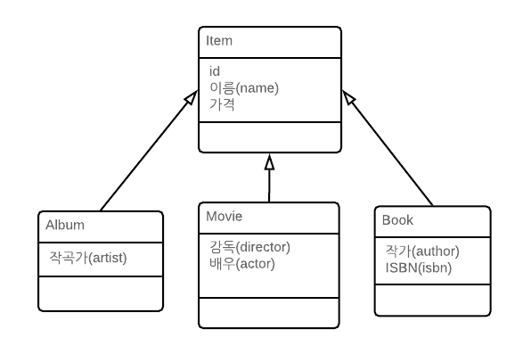
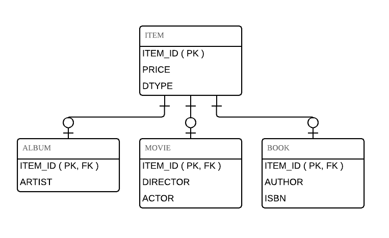

# Chapter07

## 1. 상속관계매핑

* 관계형 데이터베이스에는 상속이라는 개념 대신 슈퍼타입 서브타입 관계 모델링 기업이 객체의 상속 개념과 가장 유사하다.
* ORM에서 이야기 하는 상속 관계 매핑은 객체의 상속 구조와 데이터베이스의 슈퍼타입 서브타입 관계를 매핑하는 것.

### 1.1  슈퍼타입 서브타입 논리 모델 구현 방식

* 각각의 테이블로 변환
* 통합 테이블로 변환
* 서브타입 테이블로 변환

### 1.2 조인전략

