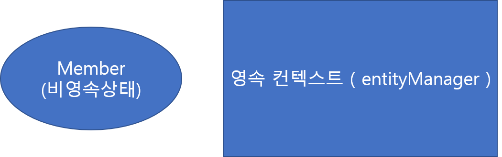
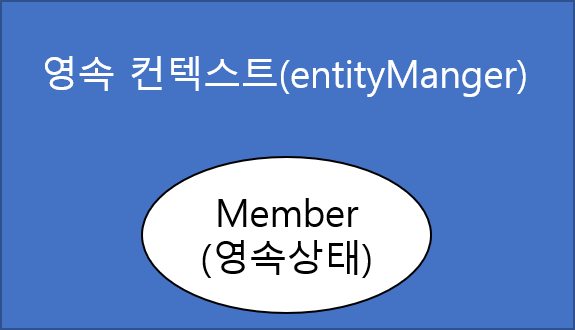

# Chapte03

## 1. 엔티티의 생명주기

* 엔티티에는 4가지의 상태가 존재함.
  * 비영속\(new/transient\) : 영속성 컨텍스트와 전혀 관계가 없는 상태
  * 영속\(managed\) : 영속성 컨테스트에 저장된 상태
  * 준영속\(detached\) : 영속성 컨텍스트에 저장되었다가 분리된 상태
  * 삭제\(removed\) : 삭제된 상태

### 1.1 비영속

* 순수한 객체 상태

```java
Member member = new Member();
member.setId("dydtjd0245");
member.setUsername("용성");
```



### 1.2 영속

* 엔티티 매니저를 통해 객체를 저장한 상태.
* 영속 상태는 영속성 컨텍스트에 관리된다는 뜻.
* 영속성 컨텍스트는 엔티티를 식별자 값으로 구분함. 엔티티에 식별자 값이 반드시 있어야 한다.

```java
em.persist(member);
```



### 1.3 준영속

* 영속성 컨텍스트에 관리되지 않는 상태
* em.close\(\) 또는 em.detach\(\) 를 통하여 준영속 상태로 변경 가능함.

```java
em.detach(member);
```

### 1.4 삭제

* 영속성 컨텍스트와 데이터베이스에서 삭제처리.

```java
em.remove(member);
```

## 2. 영속성 컨텍스트

* 엔티티 매니저 생성시에 생성됨.
* 엔티티 매니저는 엔티티를 저장하거나 조회시 영속성 컨텍스트에서 엔티티를 보관하고 관리함.

> 영속성 컨텍스트 장점
>
> * 1차 캐시
> * 동일성 보장
> * 트랜잭션을 지원하는 쓰기 지연
> * 변경 감지
> * 지연 로딩

### 2.1 엔티티 조회

* 영속성 컨텍스트에는 내부에 Map으로 캐싱 처리. 키는 @Id로 매핑한 식별자 값은 엔티티 인스턴스.
* 데이터 조회시 아래 순서로 진행
  1. 캐시에서 식별값으로 엔티티 조회
  2. 1차 캐시에 엔티티가 있을 경우 엔티티 리턴
  3. 엔티티가 없을 경우 데이터베이스에서 조회 후 엔티티 생성
  4. 생선한 엔티티를 1차 캐시에 저장 후 엔티티 리턴

> 캐싱으로 인한 장점 1. 동일한 식별자 값으로 N회 이상 조회시 데이터베이스 요청 최소화 2. 동일한 식별자 값으로 N회 이상 조회하여도 엔티티의 동일성을 보장한다.

### 2.2 엔티티 등록

* 트랜잭션 쓰기 지연\(trasactional write-behind\)을 위한 쓰기 지연 SQL 저장소 존재.
* 엔티티 컨텍스트가 1차 캐시에 저장 시점에 엔티티 정보로 SQL문을 생성하여 쓰기 지연 SQL 저장소에 저장.
* 저장된 SQL은 commit 호출시 데이터베이스에 반영된다.
* 쓰기 지연으로 변경될 SQL을 내부에 저장했다가 커밋 시점에만 데이터베이스와 통신하여 성능 최적화 가능.

> commit 호출시 처리 순서 
>
> * 영속성 컨텍스트를 플러시하여 변경내용을 데이터베이스에 동기화 처리. 
> * 동기화 완료 후 실제 데이터베이스 트랜잭션을 커밋처리.

### 2.3 엔티티 수정

#### 2.3.1 SQL 수정 쿼리의 문제점

* 기존 JDBC API를 호출하여 SQL 수정 쿼리처리시 프로젝트 규모가 커질수록 수정 쿼리가 추가될 가능성이 크다.
  * 테이블 스키마에 컬럼이 추가된 경우 쿼리를 신규로 추가하거나 if 구문이 포함될 수 있다.
* 위의 개발 방식은 수정 쿼리가 많이지며, 비지니스 로직이 SQL문에 직간접적으로 의존하게 된다.

#### 2.3.2 JPA에서 UPDATE

* 엔티티 매니저에는 변경내용을 자동으로 반영하는 변경 감지 기능이 있다.
* 변경 감지는 영속 상태의 엔티티에만 적용된다.
* JPA에서 UPDATE 기본전략은 모든 필드를 대상으로 업데이트한다.
  * 수행 쿼리가 항상 같으므로 로딩 시점에 쿼리를 생성하여 재사용 가능.
  * 데이터베이스에서 동일한 쿼리 요청시 재사용 가능.
* 변경될 내용이 너무 클 경우 하이버네이트 추가기능으로 동적으로 처리가 가능.
  
  * `org.hibernate.annotations.DynamicUpdate` 어노테이션을 엔티티 클래스에 선언
  
    

> JPA에서 UPDATE시 처리 순서 
>
> 1. 트랙잭션 커밋시 내부에서 플러시 먼저 호출. 
> 2. 1차 캐시와 스냅샷을 비교하여 변경된 엔티티 서칭 
> 3. 변경된 엔티티 존재시 수정쿼리 생성하여 쓰기지연 SQL 저장소에 저장 
> 4. 쓰기지연 저장소의 SQL을 데이터베이스에 전송 및 커밋


### 2.4 엔티티 삭제

* 엔티티 삭제의 경우로 쓰기 지연 SQL 저장소에 등록.
* remove\(\) 호출시 핸당 엔티티는 영속성 컨텍스트에서 제거.
  
  * 제거된 엔티티는 GC 대상에 포함되도록 재사용 하지 않는것이 좋다.
* 엔티티를 삭제할려면 삭제대상 엔티티를 조회해야함.

  ```java
  Member memberA = em.find(Member.class, "memberA");
  em.remove(memberA);
  ```

### 2.5 플러시 \(flush\(\)\)

* 영속성 컨텍스트의 변경 내용을 데이터베이스에 반영.
* 플러시 호출시 처리 순서. 1. 변경 감지가 동작하여 엔티티와 스냅샷 비교하여 수정된 엔티티 서칭 2. 수정된 엔티티 존재시 수정쿼리 생성하여 쓰지 지연 SQL 저장소에 등록 3. 쓰기 지연 SQL 저장소의 쿼리를 데이터베이스에 전송.
* 플러시는 3가지 방법으로 호출 가능.
  1. 엔티티 매니저의 flush\(\) 메소드 직접 호출.
     * 테스트나 다른 프레임워크와 JPA를 함께 사용할 때를 제외하고 거의 사용하지 않음.
  2. 트랜잭션 커밋 시 플러시 자동 호출.
  3. JPQL 쿼리 실행 시 플러시 자동 호출
* 플로시 모드 옵션
  * `javax.persistence.FlushModeType` 으로 설정 가능.
  * FlushModeType.AUTO : 커밋이나 쿼리를 실행할 때 플러시 \( 기본값 \)
  * FlushModeType.COMMIT : 커밋할 때만 플러시

    ```java
    em.setFlushMode(FlushModeType.COMMIT);
    ```

### 2.6 준영속

* 영속성 컨텍스트에서 분리된 상태.
* 준영속 상태에서는 영속성 컨텍스트가 제공하는 기능을 사용하지 못함.
  * 지연 로딩, 캐시 등등
* 비영속 상태에 가깝다.
  * 비영속과 다른 점은 식별값을 가지고 있다.
* 지연 로딩을 할 수 없다.
* 준영속 상태로 만드는 방법은 크게 3가지가 존재함. 1. em.detach\(entity\) : 특정 엔티티만 준영속 상태로 전환한다. 2. em.clear\(\) : 영속성 컨텍스트를 완전히 초기화한다. 3. em.close\(\) : 영속성 컨텍스트를 종료한다.

#### 2.6.1 엔티티를 준영속 상태로 전환: detach\(\)

* 특정 엔티티 하나를 준영속 상태로 변경.
* detach 호출시 영속성 컨텍스트에서 해당 엔티티 정보 삭제됨.

#### 2.6.2 영속성 컨텍스트 초기화 : clear\(\)

* 영속성 컨텍스트를 초기화하여 모든 엔티티를 준영속 상태로 변경
* 영속성 컨텍스트의 모든 정보를 제거한다.

#### 2.6.3 영속성 컨텍스트 종료 : close\(\)

* 영속성 컨텍스트롤 종료하면 관리하던 엔티티가 준영속 상태로 변경

#### 2.6.4 영속성 컨텍스트로 병합 : merge\(\)

* 준영속 상태의 엔티티를 받아서 새로운 영속 상태의 엔티티 반환
* merge 호출시 사용한 준영속 상태의 엔티티와 반환된 영속 상태의 엔티티는 다른 인스턴스임.
* 비영속 엔티티도 병합을 통하여 영속 상태의 엔티티로 변경 가능
* 병합은 비영속, 준영속을 신경쓰지 않음.
  * 식별자로 엔티티를 조회 가능한 경우 불러서 병합처리
  * 조회 불가능한 경우 새로 생성해서 병합처리
* 기능적으로 병합은 save or update 수행.

