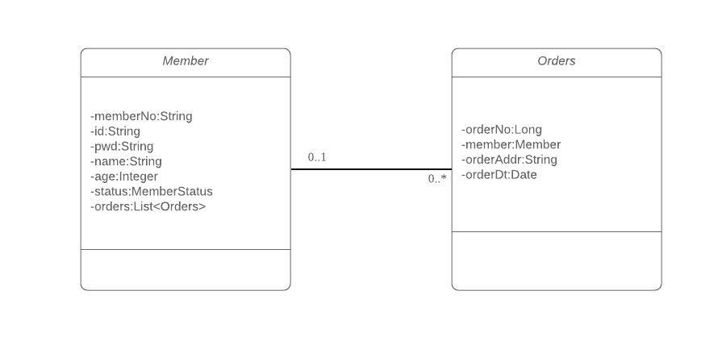
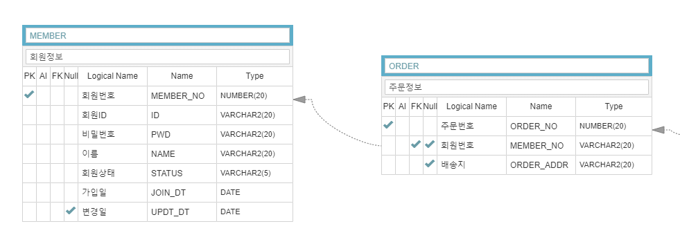

# Chapter05

## 연관관계 매핑

* 연관관계 매핑시 3가지를 고려해야함.
  * 다중성
  * 단방향, 양방향
  * 연관관계의 주인

### 1. 다중성

* 다대일 ( @ManyToOne )
* 일대다 ( @OneToMany )
* 일대일 ( @OneToOne )
* 다대다 ( @ManyToMany )

> 일대다의 반대방향은 항상 다대일이고, 일배일의 반대방향은 일대일이다.


### 2. 단방향, 양방향

#### 2.1. 단방향 연관관계와 양방향 연관관계





- 객체는 참조(주소)로 연관관계를 맺는다.
  - 객체는 그래프 탐색을 통하여 조회
  - 양방향 관계를 맺기 위해서는 단방향 관계를 2개 만들어야한다.

```java
// 객체 그래프 탐색
Member member = order.getMember()
```


- 테이블은 외래 키로 연관관계를 맺는다.
  * 외래키로 or PK로 조회가 가능하다.

```sql
// 회원번호로 주문정보 조회
SELECT T2.*
FROM MEMBER T1, ORDER T2
WHERE T1.MEMBER_NO = :memberNo
AND   T2.MEMBER_NO = T1.MEMBER_NO

// 주문정보로 회원정보 조회
SELECT T1.*
FROM MEMBER T1, ORDER T2
WHERE T1.ORDER_NO = :orderNo
AND   T2.MEMBER_NO = T1.MEMBER_NO
```


#### 2.2. 객체 관계 매핑

##### 2.2.1 단방향 연관관계 매핑

```java
// 주문 엔티티 클래스
@Entity
@Table(name = "ORDERS")
@SequenceGenerator(
        name = "ORDER_NO_SEQ_GENERATOR",
        sequenceName = "ORDER_NO_SEQ",
        initialValue = 1, allocationSize = 1)
@Setter
@Getter
public class Orders {

    @Id
    @Column(length = 20, unique = true)
    @GeneratedValue(generator = "ORDER_NO_SEQ_GENERATOR", strategy = GenerationType.SEQUENCE)
    private Long orderNo;

    // N:1 관계 매핑
    @ManyToOne
    @JoinColumn(name="MEMBER_NO")
    private Member member;
    
    ...
}    

// 회원 엔티티 클래스
@Entity
@Table(name = "MEMBER"
     , uniqueConstraints = {@UniqueConstraint(name = "", columnNames = {"NAME", "AGE"})}
)
@Getter
@Setter
public class Member {
    
    @Id
    @Column(length = 20, unique = true)
    @GenericGenerator(name = "seqGenerator"
                    , strategy = "jpa.study.entity.key.DateAndSeqCombinationGenerator"
                    ,parameters =@org.hibernate.annotations.Parameter(
                                 name = DateAndSeqCombinationGenerator.SEQUENCE_NAME_KEY
                                ,value = "MEMBER_NO_SEQ"
                                )
                    )
    @GeneratedValue(generator = "seqGenerator")
    private String memberNo;

    ...
}
```


* @ManyToOne : 다대일(N:1) 관계 매핑 정보 설정.
* @JoinColumn : 외래 키 매핑시 사용.
  * @JoinColumn 생략시 기본적략을 사용한다.
    * 기본전략 : 필드명 + _ + 참조하는 테이블의 컬럼명


##### 2.2.2 양방향 연관관계 매핑

```java
// 주문 엔티티 클래스
@Entity
@Table(name = "ORDERS")
@SequenceGenerator(
        name = "ORDER_NO_SEQ_GENERATOR",
        sequenceName = "ORDER_NO_SEQ",
        initialValue = 1, allocationSize = 1)
@Setter
@Getter
public class Orders {

    @Id
    @Column(length = 20, unique = true)
    @GeneratedValue(generator = "ORDER_NO_SEQ_GENERATOR", strategy = GenerationType.SEQUENCE)
    private Long orderNo;

    // N:1 관계 매핑
    @ManyToOne
    @JoinColumn(name="MEMBER_NO")
    private Member member;
    
    ...
}    

// 회원 엔티티 클래스
@Entity
@Table(name = "MEMBER"
     , uniqueConstraints = {@UniqueConstraint(name = "", columnNames = {"NAME", "AGE"})}
)
@Getter
@Setter
public class Member {
    
    @Id
    @Column(length = 20, unique = true)
    @GenericGenerator(name = "seqGenerator"
                    , strategy = "jpa.study.entity.key.DateAndSeqCombinationGenerator"
                    ,parameters =@org.hibernate.annotations.Parameter(
                                 name = DateAndSeqCombinationGenerator.SEQUENCE_NAME_KEY
                                ,value = "MEMBER_NO_SEQ"
                                )
                    )
    @GeneratedValue(generator = "seqGenerator")
    private String memberNo;
    
    // 1:N 관계 매핑
    @OneToMany(mappedBy = "member", fetch = FetchType.LAZY)
    private List<Orders> orders = new ArrayList<>();
    ...
}
```

* **연관관계 주인**

테이블은 외래 키 하나로 테이블의 연관관계를 관리하지만, 엔티티는 단방향으로 참조를 하나만 사용한다. 결국 엔티티에서 양방향 관계를 맺기 위해서는 `객체가 서로서로 단방향 매핑을 통하여 사용`해야한다.

 JPA에서는 `두 객체 연관관계 중 하나를 정해서 테이블의 외래키를 관리해야하는데 이것을 연관관계의 주인` 이라 한다. 

* **mappedBy 속성**

  + 주인은 mappedBy 속성을 사용하지 않는다.

  + 주인이 아닐 경우 mappedBy 속성을 사용하여 속성의 값으로 연관관계 주인을 지정해야한다.

  + mappedBy 속성 적용시 읽기만 가능하다.

    

> 데이터베이스 테이블의 다대일, 일대다 관계에서는 항상 다 쪽이 외래키를 가진다.


#### 2.3 단방향 매핑 객체 DML 사용

##### 2.3.1 연관관계 저장

```java
public static void logic(EntityManager em) {
       
    Member member = new Member();
    member.setId("kys0213");
    member.setPwd("kys0213");
    member.setName("김용성");
    member.setAge(30);
    member.setStatus(MemberStatus.A);
    em.persist(member);

    Orders order = 주문요청(em, member, "우리집");
    Orders order2 = 주문요청(em, member, "우리집");  
}

private static Orders 주문요청(EntityManager em, Member member, String addr) {
    Orders order = new Orders();
    order.setOrderAddr(addr);
    order.setMember(member); // 연관관계 매핑
    order.setOrderDt(new Date());
    em.persist(order);
    return order;
}
```


##### 2.3.2 연관관계 조회

* 객체 그래프 탐색으로 조회
* JPQL 을 사용하여 조회

```jade
String jpql = "select o from Orders o join o.member m where m.memberNo = :meberNo";
        
List<Orders> resultList = em.createQuery(jpql, Orders.class)
                            .setParameter("meberNo", member.getMemberNo())
                            .getResultList();

System.out.println("주문내역  : " + resultList);

// 결과
주문내역  : [Orders [orderNo=1, member=Member [memberNo=20190526120432000086, id=kys0213, pwd=kys0213, name=김용성, age=30, status=A], orderAddr=우리집, orderDt=Sun May 26 12:04:32 KST 2019], Orders [orderNo=2, member=Member [memberNo=20190526120432000086, id=kys0213, pwd=kys0213, name=김용성, age=30, status=A], orderAddr=우리집, orderDt=Sun May 26 12:04:32 KST 2019]]
```

```sql
// 하이버네이트를 통하여 생성된 JPQL > SQL문
/* select
        o 
    from
        Orders o 
    join
        o.member m 
    where
        m.memberNo = :meberNo */ 
select
        orders0_.order_no as order_no1_3_,
        orders0_.member_no as member_n4_3_,
        orders0_.order_addr as order_ad2_3_,
        orders0_.order_dt as order_dt3_3_ 
from
        orders orders0_ 
inner join
        member member1_ 
on orders0_.member_no=member1_.member_no 
where
      member1_.member_no=?
```


##### 2.3.3 연관관계 제거

* 연관된 엔티티 삭제시 기존 연관관계를 먼저 제거하고 삭제해야함. 

```java
Orders order = em.find(Orders.class, 1);
order.setMember(null);
```


#### 2.4. 양방향 매핑 객체 DML 사용

* 기본적인 DML 사용방법은 단방향 매핑과 똑같다.

##### 2.4.1 연관관계 저장

```java
public static void logic(EntityManager em) {
       
    Member member = new Member();
    member.setId("kys0213");
    member.setPwd("kys0213");
    member.setName("김용성");
    member.setAge(30);
    member.setStatus(MemberStatus.A);
    em.persist(member);

    Orders order = 주문요청(em, member, "우리집");
    Orders order2 = 주문요청(em, member, "우리집");  
}

private static Orders 주문요청(EntityManager em, Member member, String addr) {
    Orders order = new Orders();
    order.setOrderAddr(addr);
    order.setMember(member); // 연관관계 매핑
    order.setOrderDt(new Date());
    em.persist(order);
    return order;
}

// Orders 엔티티 클래스
@Entity
@Table(name = "ORDERS")
@SequenceGenerator(
        name = "ORDER_NO_SEQ_GENERATOR",
        sequenceName = "ORDER_NO_SEQ",
        initialValue = 1, allocationSize = 1)
@Setter
@Getter
public class Orders {

    @Id
    @Column(length = 20, unique = true)
    @GeneratedValue(generator = "ORDER_NO_SEQ_GENERATOR", strategy = GenerationType.SEQUENCE)
    private Long orderNo;

    @ManyToOne
    @JoinColumn(name="MEMBER_NO")
    private Member member;

    private String orderAddr;
    
    @Temporal(value = TemporalType.TIMESTAMP)
    private Date orderDt;

    // Member 관계 매핑시 Member의 orders도 매핑처리
    public void setMember(Member member) {
        
        // 1. 기존에 매핑된 Member가 있을 경우 관계 제거
        if(this.member != null) {
            this.member.getOrders().remove(this);
        }
        
        // 2. 새로운 Member 관계 매핑
        this.member = member;
        
        // 3. Member에도 현재 주문 엔티티 관계 매핑
        member.getOrders().add(this);
    }
    
    @Override
    public String toString() {
        return "Orders [orderNo=" + orderNo + ", member=" + member + ", orderAddr="
                + orderAddr + ", orderDt=" + orderDt + "]";
    }
}
```

* `연관관계 주인에는 값을 입력하지 않고, 주인이 아닌 곳에만 값을 입력하는 경우 정상적으로 저장되지 않는다.`
* 위의 Orders 엔티티 클래스의 setMember 메소드 처럼 매핑을 지정해야한다.


