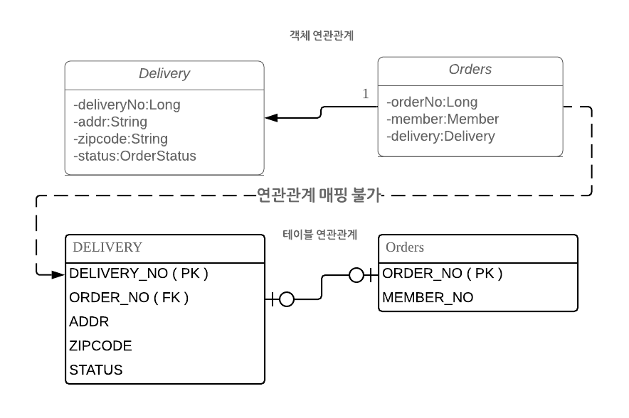
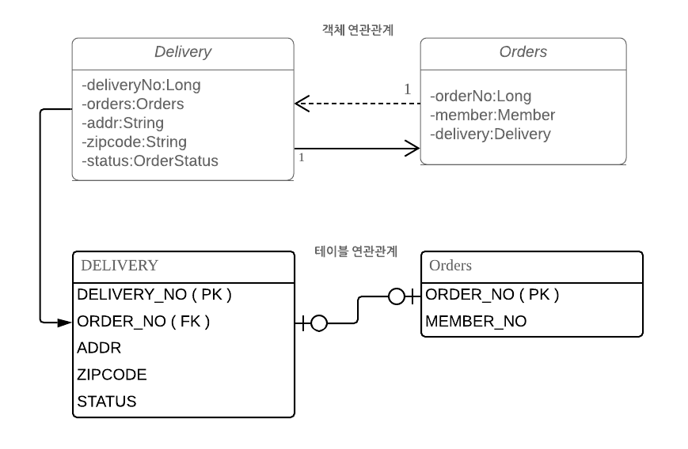
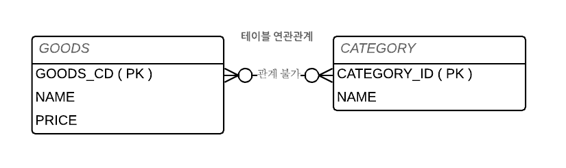
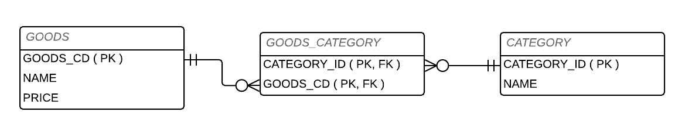

# Chapter06

## 연관관계 종류

### 1. 다대일

* 다대일과 일대다는 서로의 반대 관계
* 외래 키는 항상 다 쪽에 존재함.

#### 1.1 다대일 단방향


* 단방향 다대일 객체 매핑

```java
// Member 엔티티 클래스
@Entity
@Table(name = "MEMBER")
@Getter
@Setter
@ToString(exclude = "orders")
public class Member {
    
    @Id
    @Column(length = 20, unique = true)
    @GenericGenerator(name = "seqGenerator"
                    , strategy = "jpa.study.entity.key.DateAndSeqCombinationGenerator"
                    ,parameters =@org.hibernate.annotations.Parameter(
                                 name = DateAndSeqCombinationGenerator.SEQUENCE_NAME_KEY
                                ,value = "MEMBER_NO_SEQ"
                                )
                    )
    @GeneratedValue(generator = "seqGenerator")
    private String memberNo;

    @Column(nullable = false, length = 20)
    private String id;

    @Column(nullable = false, length = 20)
    private String pwd;

    @Column(nullable = false, length = 20)
    private String name;
    
    @Column(nullable = false)
    private Integer age;
    
    @Enumerated(EnumType.STRING)
    private MemberStatus status;
    
    ...
}

// Orders 엔티티 클래스
@Entity
@Table(name = "ORDERS")
@SequenceGenerator(
        name = "ORDER_NO_SEQ_GENERATOR",
        sequenceName = "ORDER_NO_SEQ",
        initialValue = 1, allocationSize = 1)
@Setter
@Getter
@ToString(exclude = { "member" , "orderGoods" })
public class Orders {

    @Id
    @Column(length = 20, unique = true)
    @GeneratedValue(generator = "ORDER_NO_SEQ_GENERATOR", strategy = GenerationType.SEQUENCE)
    private Long orderNo;

    // 단방향 N:1
    @ManyToOne
    @JoinColumn(name="MEMBER_NO")
    private Member member;

    public void setMember(Member member) {
        
        if(this.member != null) {
            this.member.getOrders().remove(this);
        }
        
        this.member = member;
        
        if(member != null) {
             member.getOrders().add(this);
        }
    }
    
    ...
}
```


#### 1.2 다대일 양방향

* 양방향은 외래 키가 있는 쪽인 연관관계의 주인이다.
* 양방향 연관관계는 항상 서로를 참조해야 한다.


```java
// Member 엔티티 클래스
@Entity
@Table(name = "MEMBER")
@Getter
@Setter
@ToString(exclude = "orders")
public class Member {
    
    @Id
    @Column(length = 20, unique = true)
    @GenericGenerator(name = "seqGenerator"
                    , strategy = "jpa.study.entity.key.DateAndSeqCombinationGenerator"
                    ,parameters =@org.hibernate.annotations.Parameter(
                                 name = DateAndSeqCombinationGenerator.SEQUENCE_NAME_KEY
                                ,value = "MEMBER_NO_SEQ"
                                )
                    )
    @GeneratedValue(generator = "seqGenerator")
    private String memberNo;

    @Column(nullable = false, length = 20)
    private String id;

    @Column(nullable = false, length = 20)
    private String pwd;

    @Column(nullable = false, length = 20)
    private String name;
    
    @Column(nullable = false)
    private Integer age;
    
    @Enumerated(EnumType.STRING)
    private MemberStatus status;
    
    // 1:N 매핑
    @OneToMany(mappedBy = "member", fetch = FetchType.LAZY)
    private List<Orders> orders = new ArrayList<>();
    
    ...
}

// Orders 엔티티 클래스
@Entity
@Table(name = "ORDERS")
@SequenceGenerator(
        name = "ORDER_NO_SEQ_GENERATOR",
        sequenceName = "ORDER_NO_SEQ",
        initialValue = 1, allocationSize = 1)
@Setter
@Getter
@ToString(exclude = { "member" , "orderGoods" })
public class Orders {

    @Id
    @Column(length = 20, unique = true)
    @GeneratedValue(generator = "ORDER_NO_SEQ_GENERATOR", strategy = GenerationType.SEQUENCE)
    private Long orderNo;

    // N:1 매핑
    @ManyToOne
    @JoinColumn(name="MEMBER_NO")
    private Member member;

    public void setMember(Member member) {
        
        if(this.member != null) {
            this.member.getOrders().remove(this);
        }
        
        this.member = member;
        
        if(member != null) {
             // member에 객체 참조
             member.getOrders().add(this);
        }
    }
    
    ...
}
```


### 2. 일대다

* 일대다 관계는 다대일 관계의 반대 방향이다.
* 일대다 관계는 자바 Collection, List, Set, Meap 중에 하나를 사용해야함.


#### 2.1 일대다 단방향

* 보통과 달리 `반대쪽 테이블에 있는 외래 키를 관리`한다.
* 일대다 단방향의 경우 매핑시에 @JoinColumn을 명시해야 한다. 명시 하지 않을 경우 연관관계를 관리하는 조인 테이블 전략을 기본으로 사용한다.


```java
// Member 엔티티 클래스
@Entity
@Table(name = "MEMBER")
@Getter
@Setter
@ToString(exclude = "orders")
public class Member {
    
    @Id
    @Column(length = 20, unique = true)
    @GenericGenerator(name = "seqGenerator"
                    , strategy = "jpa.study.entity.key.DateAndSeqCombinationGenerator"
                    ,parameters =@org.hibernate.annotations.Parameter(
                                 name = DateAndSeqCombinationGenerator.SEQUENCE_NAME_KEY
                                ,value = "MEMBER_NO_SEQ"
                                )
                    )
    @GeneratedValue(generator = "seqGenerator")
    private String memberNo;

    // 1:N 단방향 매핑.
    @OneToMany
    @JoinColumn(name = "MEMBER_NO") // Orders의 MEMBER_NO 컬럼으로 JOIN
    private List<Orders> orders = new ArrayList<>();
    
    ...

}

// Orders 엔티티 클래스
@Entity
@Table(name = "ORDERS")
@SequenceGenerator(
        name = "ORDER_NO_SEQ_GENERATOR",
        sequenceName = "ORDER_NO_SEQ",
        initialValue = 1, allocationSize = 1)
@Setter
@Getter
@ToString
public class Orders {

    @Id
    @Column(length = 20, unique = true)
    @GeneratedValue(generator = "ORDER_NO_SEQ_GENERATOR", strategy = GenerationType.SEQUENCE)
    private Long orderNo;
    
    @OneToOne
    @JoinColumn(name="DELIVERY_NO")
    private Delivery delivery;
 
    public void setDelivery(Delivery delivery) {
        this.delivery = delivery;
        
        if(delivery != null) {
            delivery.setOrder(this);
        }
    }
}
```


##### 2.1.1 일대다 단방향 매핑의 단점

* 매핑한 객체과 관리하는 외래 키가 다른 테이블에 존재.

* 본인 테이블에 외래 키가 있으면 연관관계 처리시 INSERT로 처리 가능하지만, 다른 테이블에 외래 키가 있을 경우 UPDATE 를 추가로 실행해야함.

```java
 public void logic(EntityManager em) {
        
     Member member = makeMember(em);

     Orders order = 주문요청(em, member, "우리집");
     Orders order2 = 주문요청(em, member, "우리집");
 }

private Orders 주문요청(EntityManager em, Member member, String addr) {
    Orders order = new Orders();
    order.setOrderDt(new Date());
    em.persist(order); // INSERT
    member.getOrders().add(order); // 1:N 연관관계 매핑 
    return order;
}

private static Member makeMember(EntityManager em) {
    Member member = new Member();
    member.setId("kys0213");
    member.setPwd("kys0213");
    member.setName("김용성");
    member.setAge(30);
    member.setStatus(MemberStatus.A);
    em.persist(member); // INSERT
    return member;
}
```

```sql
Hibernate: 
    /* insert jpa.study.entity.Member
        */ insert 
        into
            member
            (age, id, name, pwd, status, member_no) 
        values
            (?, ?, ?, ?, ?, ?)
Hibernate: 
    /* insert jpa.study.entity.Orders
        */ insert 
        into
            orders
            (delivery_no, order_dt, order_no) 
        values
            (?, ?, ?)
Hibernate: 
    /* insert jpa.study.entity.Orders
        */ insert 
        into
            orders
            (delivery_no, order_dt, order_no) 
        values
            (?, ?, ?)
Hibernate: 
    /* create one-to-many row jpa.study.entity.Member.orders */ update
        orders 
    set
        member_no=? 
    where
        order_no=?
Hibernate: 
    /* create one-to-many row jpa.study.entity.Member.orders */ update
        orders 
    set
        member_no=? 
    where
        order_no=?
```


#### 2.2 일대다 양방향

* 양방향 매핑에서는 @OneToMany는 연관관계 주인이 될 수 없다.
* 관계형 데이터 베이스 특성상 항상 다 쪽에 외래키가 존재하고, 해당 이유로 @ManyToOne에는 mappedBy 속성이 없다.
* 일대다 양방향 매핑은 `읽기 전용으로 다대일 단방향 매핑`을 추가해야한다.


```java
// Member 엔티티 클래스
@Entity
@Table(name = "MEMBER")
@Getter
@Setter
@ToString(exclude = "orders")
public class Member {
    
    @Id
    @Column(length = 20, unique = true)
    @GenericGenerator(name = "seqGenerator"
                    , strategy = "jpa.study.entity.key.DateAndSeqCombinationGenerator"
                    ,parameters =@org.hibernate.annotations.Parameter(
                                 name = DateAndSeqCombinationGenerator.SEQUENCE_NAME_KEY
                                ,value = "MEMBER_NO_SEQ"
                                )
                    )
    @GeneratedValue(generator = "seqGenerator")
    private String memberNo;
    
    // 1:N 단방향 매핑.
    @OneToMany
    @JoinColumn(name = "MEMBER_NO") // Orders의 MEMBER_NO 컬럼으로 JOIN
    private List<Orders> orders = new ArrayList<>();

    ...
}

// Orders 엔티티 클래스
@Entity
@Table(name = "ORDERS")
@SequenceGenerator(
        name = "ORDER_NO_SEQ_GENERATOR",
        sequenceName = "ORDER_NO_SEQ",
        initialValue = 1, allocationSize = 1)
@Setter
@Getter
@ToString(exclude = { "member" ,"orderGoods" })
public class Orders {

    @Id
    @Column(length = 20, unique = true)
    @GeneratedValue(generator = "ORDER_NO_SEQ_GENERATOR", strategy = GenerationType.SEQUENCE)
    private Long orderNo;
    
    // 읽기 전용으로 양방향 매핑
    @ManyToOne
    @JoinColumn(name="MEMBER_NO", insertable = false, updatable = false) 
    private Member member;
    
   ...
}
```

##### 2.2.1 일대다 양방향 매핑의 단점

* 일대다 단방향 매핑의 단점을 그대로 가진다.
* 될 수 있으면 **다대일 양방향 매핑을 사용**해야한다.


### 3. 일대일

* 일대일 관계는 서로 하나의 관계만 가진다.
* 일대일 관계는 그 반대도 일대일이다.
* 일대일 관계는 주 테이블이나 대상 테이블 둘 중 어느 곳이나 외래키를 가질 수 있다.
  * 주 테이블에 외래 키
    * 테이블이 외래 키를 가지고 있으므로 주 테이블만 확인해도 대상 테이블과 연관관계가 있는지 알 수 있다.
  * 대상 테이블에 외래 키
    * 테이블 관계를 일대일에서 일대다로 변경할 때 테이블 구조를 그대로 유지 가능하다.


#### 3.1 주 테이블에 외래 키

* 객체지향 개발자들은 주 테이블에 외래 키가 있는 것을 선호한다.
* JPA에서 주 테이블에 외래 키가 있으면 좀 더 편리하게 매핑할 수 있다.


##### 3.1.1 단방향


* 일대일 관계이므로 @OneToOne을 사용하여 매핑한다.

```java
// Order 엔티티 클래스
@Entity
@Table(name = "ORDERS")
@SequenceGenerator(name = "ORDER_NO_SEQ_GENERATOR", sequenceName = "ORDER_NO_SEQ", initialValue = 1, allocationSize = 1)
@Setter
@Getter
@ToString(exclude = { "member", "orderGoods" })
public class Orders {

    @Id
    @Column(length = 20, unique = true)
    @GeneratedValue(generator = "ORDER_NO_SEQ_GENERATOR", strategy = GenerationType.SEQUENCE)
    private Long orderNo;

    @ManyToOne
    @JoinColumn(name = "MEMBER_NO")
    private Member member;

    // 1:1 단방향 매핑
    @OneToOne 
    @JoinColumn(name = "DELIVERY_NO")
    private Delivery delivery;

    public void setMember(Member member) {

        if (this.member != null) {
            this.member.getOrders().remove(this);
        }

        this.member = member;

        if (member != null) {
            member.getOrders().add(this);
        }
    }
}

// Delivery 엔티티 클래스
@Entity(name = "DELIVERY")
@Getter
@Setter
@NoArgsConstructor
@ToString(exclude = "order")
public class Delivery {

    @Id
    @GeneratedValue(strategy = GenerationType.IDENTITY)
    private String deliveryNo;

    private String addr;

    private String zipcode;

    @Enumerated(EnumType.STRING)
    private OrderStatus status;

}
```


##### 3.1.2 양방향


* Orders에 Delivery 외래키가 존재하므로 Orders.delivery가 연관관계 주인이다.
* Delivery.orders에 mappedBy를 사용하여 주인이 아니라고 설정한다.

```java
// Orders 엔티티 클래스
@Entity
@Table(name = "ORDERS")
@SequenceGenerator(name = "ORDER_NO_SEQ_GENERATOR", sequenceName = "ORDER_NO_SEQ", initialValue = 1, allocationSize = 1)
@Setter
@Getter
@ToString(exclude = { "member", "orderGoods" })
public class Orders {

    @Id
    @Column(length = 20, unique = true)
    @GeneratedValue(generator = "ORDER_NO_SEQ_GENERATOR", strategy = GenerationType.SEQUENCE)
    private Long orderNo;

    @ManyToOne
    @JoinColumn(name = "MEMBER_NO")
    private Member member;

    @OneToOne
    @JoinColumn(name = "DELIVERY_NO")
    private Delivery delivery;

    @OneToMany(mappedBy = "orders", fetch = FetchType.LAZY)
    private List<OrderGoods> orderGoods = new ArrayList<>();

    @Temporal(value = TemporalType.TIMESTAMP)
    private Date orderDt;

    public void setMember(Member member) {

        if (this.member != null) {
            this.member.getOrders().remove(this);
        }

        this.member = member;

        if (member != null) {
            member.getOrders().add(this);
        }
    }

    // Delivery 연관관계 매핑 처리
    public void setDelivery(Delivery delivery) {
        
        this.delivery = delivery;

        if (delivery != null) {
            delivery.setOrder(this);
        }
    }
}

// Delivery 엔티티 클래스
@Entity(name = "DELIVERY")
@Getter
@Setter
@NoArgsConstructor
@ToString(exclude = "order")
public class Delivery {

    @Id
    @GeneratedValue(strategy = GenerationType.IDENTITY)
    private String deliveryNo;

    private String addr;

    private String zipcode;

    @Enumerated(EnumType.STRING)
    private OrderStatus status;
    
    // 1:1 단방향 매핑
    // ERD상 Orders에 Delivery 외래 키가 존재하므로 mappedBy 속성을 지정
    @OneToOne(mappedBy = "delivery")
    private Orders order;

}
```


#### 3.2 대상 테이블에 외래 키

##### 3.2.1 단방향



* 대상 테이블에 외래 키가 있는 단방향 관계는 JPA에서 지원하지 않으며, 매핑할 수 있는 방법도 없다.
* 위의 케이스에서 단방향 관계를 Delivery 에서 Orders 방향으로 수정하거나 양방향 관계로 만들고 Delivery를 연관관계의 주인으로 설정해야한다. 


##### 3.2.2 양방향



```java
// Orders 엔티티 클래스
@Entity
@Table(name = "ORDERS")
@SequenceGenerator(name = "ORDER_NO_SEQ_GENERATOR", sequenceName = "ORDER_NO_SEQ", initialValue = 1, allocationSize = 1)
@Setter
@Getter
@ToString(exclude = { "member" })
public class Orders {

    @Id
    @Column(length = 20, unique = true)
    @GeneratedValue(generator = "ORDER_NO_SEQ_GENERATOR", strategy = GenerationType.SEQUENCE)
    private Long orderNo;

    @ManyToOne
    @JoinColumn(name = "MEMBER_NO")
    private Member member;

    // Orders에 외래키가 존재하지 않으므로 mappedBy 설정
    @OneToOne(mappedBy = "order")
    private Delivery delivery;

    public void setMember(Member member) {

        if (this.member != null) {
            this.member.getOrders().remove(this);
        }

        this.member = member;

        if (member != null) {
            member.getOrders().add(this);
        }
    }
}

// Delivery 엔티티 클래스
@Entity(name = "DELIVERY")
@Getter
@Setter
@NoArgsConstructor
@ToString(exclude = "order")
public class Delivery {

    @Id
    @GeneratedValue(strategy = GenerationType.IDENTITY)
    private String deliveryNo;
    
    // 1:1 매핑
    // ORDER_NO를 JoinColumn 지정하여 매핑함.
    @OneToOne
    @JoinColumn(name = "ORDER_NO")
    private Orders order;

    private String addr;

    private String zipcode;

    @Enumerated(EnumType.STRING)
    private OrderStatus status;
    
    public void setOrder(Orders order) {
        
        this.order = order;
      
        // Orders의 Delivery 매핑 처리
        if(order != null) {
            order.setDelivery(this);
        }
    }
}
```


### 4. 다대다

* 관계형 데이터베이스에서 정규화된 테이블 2개로 다대다 관계를 표현할 수 없다.

* 보통 다대다 관계를 일대다, 다대일 관계로 풀어내는 연결테이블을 사용한다.





* 객체는 테이블과 다르게 2개로 다대다 관계를 만들 수 있다.


#### 4.1 다대다 단방향

```java
// Goods 엔티티 클래스
@Entity
@Table(name = "GOODS")
@NoArgsConstructor
@TableGenerator(
        name="GOODS_SEQ_GENERATOR",
        table = "MY_SEQUENCES",
        pkColumnValue = "goodsCd", allocationSize = 1
        )
@Getter
@Setter
@ToString
public class Goods {

    @Id
    @Column(unique = true)
    @GeneratedValue(strategy = GenerationType.TABLE, generator="GOODS_SEQ_GENERATOR")
    private Long goodsCd;

    @Column(nullable = false, length = 200)
    private String goodsName;

    @Column(nullable = false)
    private Long goodsPrice;
}

// Category 엔티티 클래스
@Entity
@Table(name = "CATEGORY")
@TableGenerator(pkColumnValue = "id", name = "CATEGORY")
@Getter
@Setter
@ToString
public class Category {

    @Id
    @GeneratedValue
    @Column(name = "CATEGORY_ID")
    private Long id;
    
    private String name;
    
    @ManyToMany
    @JoinTable(name = "GOODS_CATAGORY"
              , joinColumns = @JoinColumn(name = "GOODS_CD")
              , inverseJoinColumns = @JoinColumn(name = "CATEGORY_ID")
              )
    private List<Goods> goods = new ArrayList<>();

}
```

* @ManyToMany과 @JoinTable을 통하여 매핑 처리.

  

>  @JoinTable 속성
>
> * name : 연결테이블을 지정한다.
> * joinColumns : 매핑할 조인 컬럼 정보를 지정한다.
> * inverseJoinColumns : 반대 방향인 상품과 매핑할 조인 정보를 지정한다.


##### 4.1.1 다대다 단방향 저장

```java
public void saveManyToMany(EntityManager em) {

    Goods goods = new Goods();
    goods.setGoodsPrice(1000l);
    goods.setGoodsName("허쉬초코우유");

    Goods goods2 = new Goods();
    goods2.setGoodsPrice(1000l);
    goods2.setGoodsName("초코에몽");

    Category category = new Category();
    category.setName("음료수");
    category.getGoods().add(goods);
    category.getGoods().add(goods2);

    em.persist(category);
    em.persist(goods);
    em.persist(goods2);
}
```

```sql
Hibernate: 
    /* insert jpa.study.entity.Category
        */ insert 
        into
            category
            (name, category_id) 
        values
            (?, ?)
Hibernate: 
    /* insert jpa.study.entity.Goods
        */ insert 
        into
            goods
            (goods_name, goods_price, goods_cd) 
        values
            (?, ?, ?)
Hibernate: 
    /* insert jpa.study.entity.Goods
        */ insert 
        into
            goods
            (goods_name, goods_price, goods_cd) 
        values
            (?, ?, ?)
Hibernate: 
    /* insert collection
        row jpa.study.entity.Category.goods */ insert 
        into
            goods_catagory
            (goods_cd, category_id) 
        values
            (?, ?)
Hibernate: 
    /* insert collection
        row jpa.study.entity.Category.goods */ insert 
        into
            goods_catagory
            (goods_cd, category_id) 
        values
            (?, ?)
```

##### 4.1.2 다대다 단방향 조회

```java
public void findManyToMany(EntityManager em) {
        
    Category category = em.find(Category.class, 1l);

    // GOODS_CATAGORY 그래프 탐색
    List<Goods> goods = category.getGoods();

    for (Goods good : goods) {
        System.out.println(good.toString());
    }
}
// 결과
Goods(goodsCd=1, goodsName=허쉬초코우유, goodsPrice=1000)
Goods(goodsCd=2, goodsName=초코에몽, goodsPrice=1000)
```

```sql
// find 를 사용하여 pk로 조회한 쿼리
Hibernate: 
    select
        category0_.category_id as category1_0_0_,
        category0_.name as name2_0_0_ 
    from
        category category0_ 
    where
        category0_.category_id=?
        
// 그래프 탐색을 통하여 조회한 쿼리        
Hibernate: 
    select
        goods0_.goods_cd as goods_cd1_0_0_,
        goods0_.category_id as category2_3_0_,
        goods1_.goods_cd as goods_cd1_2_1_,
        goods1_.goods_name as goods_na2_2_1_,
        goods1_.goods_price as goods_pr3_2_1_ 
    from
        goods_catagory goods0_ 
    inner join
        goods goods1_ 
            on goods0_.category_id=goods1_.goods_cd 
    where
        goods0_.goods_cd=?
```

#### 4.2 다대다 양방향

* 역방향도 @ManyToMany를 사용하여 연관관계를 매핑한다.
* 두 객체에서 원하는 곳에 mappedBy 속성을 사용하여 연관관계 주인을 지정한다.

```java
// Goods 엔티티 클래스
@Entity
@Table(name = "GOODS")
@NoArgsConstructor
@TableGenerator(
        name="GOODS_SEQ_GENERATOR",
        table = "MY_SEQUENCES",
        pkColumnValue = "goodsCd", allocationSize = 1
        )
@Getter
@Setter
@ToString
public class Goods {

    @Id
    @Column(unique = true)
    @GeneratedValue(strategy = GenerationType.TABLE, generator="GOODS_SEQ_GENERATOR")
    private Long goodsCd;

    @Column(nullable = false, length = 200)
    private String goodsName;

    @Column(nullable = false)
    private Long goodsPrice;
    
    // N:N 매핑 추가
    @ManyToMany(mappedBy = "goods")
    private List<Category> categorys = new ArrayList<>();
}

// Category 엔티티 클래스
@Entity
@Table(name = "CATEGORY")
@TableGenerator(pkColumnValue = "id", name = "CATEGORY")
@Getter
@Setter
@ToString
public class Category {

    @Id
    @GeneratedValue
    @Column(name = "CATEGORY_ID")
    private Long id;
    
    private String name;
    
    @ManyToMany
    @JoinTable(name = "GOODS_CATAGORY"
              , joinColumns = @JoinColumn(name = "GOODS_CD")
              , inverseJoinColumns = @JoinColumn(name = "CATEGORY_ID")
              )
    private List<Goods> goods = new ArrayList<>();

    // 양방향 매핑을 위한 편의 메소드 생성
    public void addGoods(Goods goods) {
       
        this.goods.add(goods);
        goods.getCategorys().add(this);
    }
}
```

#### 4.3 다대다 매핑의 한계

* 조인 테이블에 컬럼을 추가할 수 없어서 실무에서 사용하기에는 한계가 있다.
* 다대다 매핑시 조인 테이블대신 연결테이블을 추가하여 매핑해야 한다.

