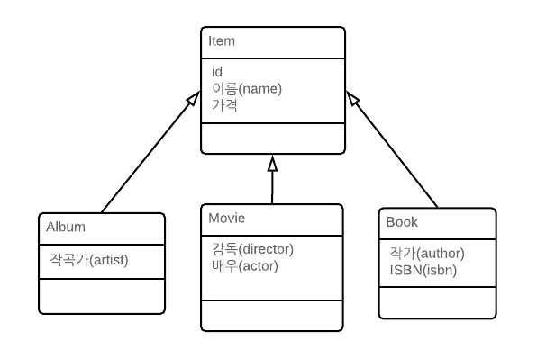

# Chapter07 : 고급 매핑

## 1. 상속관계매핑

* 관계형 데이터베이스에는 상속이라는 개념 대신 슈퍼타입 서브타입 관계 모델링 기업이 객체의 상속 개념과 가장 유사하다.
* ORM에서 이야기 하는 상속 관계 매핑은 객체의 상속 구조와 데이터베이스의 슈퍼타입 서브타입 관계를 매핑하는 것.

### 1.1  슈퍼타입 서브타입 논리 모델 구현 방식



* 각각의 테이블로 변환
* 통합 테이블로 변환
* 서브타입 테이블로 변환


### 1.2 조인전략


* 자식테이블이 부모테이블의 기본 키를 받아서 키 + 외래 키로 사용하는 전략이다.

* 조회할 때 조인이 자주 사용된다.

* 타입을 구분하는 컬럼을 추가하여 사용한다.

```java
@Entity
@Inheritance(strategy = InheritanceType.JOINED)
@Table(name = "GOODS")
@TableGenerator(
        name="GOODS_SEQ_GENERATOR",
        table = "MY_SEQUENCES",
        pkColumnValue = "goodsCd", allocationSize = 1
        )
@NoArgsConstructor
@Getter
@Setter
@ToString(exclude = "goodsCategorys")
public abstract class Goods {

    @Id
    @Column(unique = true)
    @GeneratedValue(strategy = GenerationType.TABLE, generator="GOODS_SEQ_GENERATOR")
    private Long goodsCd;

    @Column(nullable = false, length = 200)
    private String name;

    @Column(nullable = false)
    private Long price;
    
    @Enumerated
    private GoodsType goodsType;
    
    @OneToMany(mappedBy = "goods", fetch = FetchType.LAZY)
    private List<GoodsCategory> goodsCategorys = new ArrayList<>();

    public Goods(String name, Long price) {
        super();
        this.name = name;
        this.price = price;
    }
}

// Goods 를 상속받은 chicken 메뉴 정보 테이블
@Entity
@Table(name = "GOODS_CHICHEN")
@DiscriminatorValue("C")
@Getter
@Setter
@NoArgsConstructor
@ToString(callSuper = true)
public class Chicken extends Goods{

    @Column(nullable = false)
    private Long size;
    
}

// Goods 를 상속받은 Drink 메뉴 정보 테이블
@Entity
@Table(name = "GOODS_DRINK")
@DiscriminatorValue("D")
@Getter
@Setter
@NoArgsConstructor
@ToString(callSuper = true)
public class Drink extends Goods{

    @Column(nullable = false)
    private Long ml;
}

// Goods 를 상속받은 Hamburger 메뉴 정보 테이블
@Entity
@Table(name = "GOODS_DRINK")
@DiscriminatorValue("H")
@Getter
@Setter
@NoArgsConstructor
@ToString(callSuper = true)
public class Hamburger extends Goods{

    @Column(nullable = false)
    private Long ml;
}
```

#### 1.2.1 조인전략 설정

##### 1.2.1.1 @Inheritance

* 상속 매핑은 @Inheritance를 사용해야함.
* 매핑적략은 조인테이블 이므로 `InheritanceType.JOINED` 를 사용한다.

##### 1.2.1.2 @DiscriminatorColumn

* 부모 클래스에 구분 컬럼을 지정한다. 
* 해당 컬럼으로 저장된 자식 테이블을 구분할 수 있다.
* 기본값이 DTYPE이므로 @DiscriminatorColmun으로 줄여서 사용 가능하다.

##### 1.2.1.3 @DiscriminatorValue

* 엔티티를 저장할 때 구분 컬럼에 입력할 값을 지정한다.

##### 1.2.1.4 @PrimaryKeyJoinColumn

* 자식테이블의 기본키 컬럼병을 변경하고 싶을 경우 사용한다.

#### 1.2.2 조인전략 장단점

* 장점
  * 테이블이 정규화된다.
  * 외래 키 참조 무결성 제약조건을 활용할 수 있다.
  * 저장공간을 효율적으로 사용한다.
* 단점
  * 조회할 때 조인이 맣이 사용되므로 성능이 저하될 수 있다.
  * 조회 쿼리가 복잡하다.
  * 데이터를 등록할 INSERT SQL을 두 번 실행한다.


### 1.3 단일 테이블 전략


* 자식 엔티티가 매핑한 컬럼은 모두 null을 허용해야 한다.

#### 1.3.1 단일테이블 전략 설정

```java
@Entity
@Inheritance(strategy = InheritanceType.SINGLE_TABLE)
@Table(name = "GOODS")
@TableGenerator(
        name="GOODS_SEQ_GENERATOR",
        table = "MY_SEQUENCES",
        pkColumnValue = "goodsCd", allocationSize = 1
        )
@NoArgsConstructor
@Getter
@Setter
@ToString(exclude = "goodsCategorys")
public abstract class Goods {

    @Id
    @Column(unique = true)
    @GeneratedValue(strategy = GenerationType.TABLE, generator="GOODS_SEQ_GENERATOR")
    private Long goodsCd;

    @Column(nullable = false, length = 200)
    private String name;

    @Column(nullable = false)
    private Long price;
    
    @Enumerated
    private GoodsType goodsType;
    
    @OneToMany(mappedBy = "goods", fetch = FetchType.LAZY)
    private List<GoodsCategory> goodsCategorys = new ArrayList<>();

    public Goods(String name, Long price) {
        super();
        this.name = name;
        this.price = price;
    }
}

// Goods 를 상속받은 chicken 메뉴 정보 테이블
@Entity
@DiscriminatorValue("C")
@Getter
@Setter
@NoArgsConstructor
@ToString(callSuper = true)
public class Chicken extends Goods{

    @Column
    private Long size;
    
}

// Goods 를 상속받은 Drink 메뉴 정보 테이블
@Entity
@DiscriminatorValue("D")
@Getter
@Setter
@NoArgsConstructor
@ToString(callSuper = true)
public class Drink extends Goods{

    @Column
    private Long ml;
}

// Goods 를 상속받은 Hamburger 메뉴 정보 테이블
@Entity
@DiscriminatorValue("H")
@Getter
@Setter
@NoArgsConstructor
@ToString(callSuper = true)
public class Hamburger extends Goods{

    @Column
    private Long ml;
}
```


#### 1.3.2 단일테이블 전략 장단점

* 장점
  * 조인이 필요 없으므로 일반적으로 조회 성능이 빠르다.
  * 조회 쿼리가 단순하다
* 단점
  * 자식 엔티티가 매핑한 컬럼은 모두 null을 허용해야 한다.
  * 다일 테이블에 모든 것을 저장하므로 테이블이 커질 수 있다. 상황에 따라서 조회 성능이 느려질 수 있다.
* 특징
  *  @DiscriminatorColumn 설정 필수
  * 지정하지 않을 경우 엔티티 이름을 사용한다.


### 1.4 구현클래스별 테이블 전략


* 구현 클래스마다 테이블을 생성한다. 
* 일반적으로 추천하지 않는 전략이다.


#### 1.4.1 구현클래스별 테이블 전략 설정

```java
@Entity
@Inheritance(strategy = InheritanceType.TABLE_PER_CLASS)
@Table(name = "GOODS")
@TableGenerator(
        name="GOODS_SEQ_GENERATOR",
        table = "MY_SEQUENCES",
        pkColumnValue = "goodsCd", allocationSize = 1
        )
@NoArgsConstructor
@Getter
@Setter
@ToString(exclude = "goodsCategorys")
public abstract class Goods {

    @Id
    @Column(unique = true)
    @GeneratedValue(strategy = GenerationType.TABLE, generator="GOODS_SEQ_GENERATOR")
    private Long goodsCd;

    @Column(nullable = false, length = 200)
    private String name;

    @Column(nullable = false)
    private Long price;
    
    @Enumerated
    private GoodsType goodsType;
    
    @OneToMany(mappedBy = "goods", fetch = FetchType.LAZY)
    private List<GoodsCategory> goodsCategorys = new ArrayList<>();

    public Goods(String name, Long price) {
        super();
        this.name = name;
        this.price = price;
    }
}

// Goods 를 상속받은 chicken 메뉴 정보 테이블
@Entity
@DiscriminatorValue("C")
@Getter
@Setter
@NoArgsConstructor
@ToString(callSuper = true)
public class Chicken extends Goods{

    @Column
    private Long size;
    
}

// Goods 를 상속받은 Drink 메뉴 정보 테이블
@Entity
@DiscriminatorValue("D")
@Getter
@Setter
@NoArgsConstructor
@ToString(callSuper = true)
public class Drink extends Goods{

    @Column
    private Long ml;
}

// Goods 를 상속받은 Hamburger 메뉴 정보 테이블
@Entity
@DiscriminatorValue("H")
@Getter
@Setter
@NoArgsConstructor
@ToString(callSuper = true)
public class Hamburger extends Goods{

    @Column
    private Long ml;
}
```


#### 1.4.2 구현클래스별 테이블 전략 설정 장단점

* 장점
  * 서브 타입을 구분해서 처리할 때 효과적이다.
  * not null 제약조건을 사용할 수 있다.
* 단점
  * 여러 자식 테이블을 함께 조회할 때 성능이 느리다.
  * 자식 테이블을 통합해서 쿼리하기 어렵다.


### 1.5 @MappedSuperclass

* 테이블과 매핑하지 않고 자식 클래스에게 매핑 정보만 제공하고 싶을경우 사용한다.
* 추상클래스와 비슷하며 실제 테이블과 매핑하지 않는다.
* 테이블과 관계가 없고 단순히 엔티티가 공통으로 사용하는 매핑 정보를 모아주는 역할을 한다.
* 등록일자, 수정일자, 등록자, 수정자 같은 여러 엔티티에서 공통으로 사용하는 속성을 관리 할 수 있다.


#### 1.5.1 @AttributeOverrides, @AttributeOverride

* 부모로부터 물려받은 매핑 정보를 재정의할 때 사용한다.

```java
@Getter
@Setter
@MappedSuperclass
public abstract class DateBaseEntity {

    @Column(name = "REG_DT")
    @Temporal(value = TemporalType.TIMESTAMP)
    private Date regDt;
    
    @Column(name = "CHG_DT")
    @Temporal(value = TemporalType.TIMESTAMP)
    private Date chgDt;
}
```

```java
@AttributeOverride(name = "regDt", column = @Column(name = "ORDER_DT"))
public class Orders extends DateBaseEntity{ ... }
```

```java
@AttributeOverrides({
    @AttributeOverride(name = "regDt", column = @Column(name = "ORDER_DT"))
    , @AttributeOverride(name = "chgDt", column = @Column(name = "ORDER_CHG_DT"))
})
public class Orders extends DateBaseEntity{ ... }
```

#### 1.5.2 @AssociationOverrides, @AssociationOverride

* 부모로부터 물려받은 연관관계를 재정의할 때 사용한다.


## 2. 복합 키와 식별관계매핑

* 테이블 사이에 관계는 외래 키가 기본 키 포함되는지 여부에 따라서 식별 관계와 비식별 관계로 구분함.

### 2.1 식별관계 ( Identifying Relationship )

* 부모테이블의 기본 키를 내려 받아서 자식 테이블의 기본 키 + 외래키로 사용한다.


### 2.2 복합키 매핑

* JPA는 영속성 컨텍스트에 엔티티를 보관할 때 엔티티의 식별자를 키로 사용하고 equals와 hashCode를 사용해서 동등성 비교를 한다. 
* 식별자 필드가 2개 이상일 경우 별도의 식별자 클래스를 만들고 equals와 hashCode를 구현해야 한다.


#### 2.2.1 @IdClass

##### 2.2.1.2 식별관계

```java
@Getter
@Setter
@NoArgsConstructor
@Entity
@Table(name = "PARENT")
public class Parent {

    @Id
    @Column(name = "PARENT_ID")
    private String id;
    
    private String name;
}

@Getter
@Setter
@NoArgsConstructor
@Table(name = "CHILD")
@Entity
@IdClass(ChildId.class)
public class Child {
    
    @Id
    @ManyToOne
    @JoinColumn(name = "PARENT_ID")
    private Parent parent;
    
    @Id
    @Column(name = "CHILD_ID")
    private String childId;
    
    private String name;
}

@SuppressWarnings("serial")
@Getter
@Setter
@AllArgsConstructor
@NoArgsConstructor
@EqualsAndHashCode
public class ChildId implements Serializable{

    private String parent;
    
    private String childId;
}

@Getter
@Setter
@NoArgsConstructor
@Table(name = "GRANDCHILD")
@Entity
@IdClass(GrandChildId.class)
public class GrandChild {

    @Id
    @ManyToOne
    @JoinColumns({
        @JoinColumn(name = "PARENT_ID", referencedColumnName = "PARENT_ID"),
        @JoinColumn(name = "CHILD_ID", referencedColumnName = "CHILD_ID")
    })
    private Child child;
    
    @Id
    @Column(name = "GRANDCHILD_ID")
    private String id;
    
    private String name;
    
}

@SuppressWarnings("serial")
@Getter
@Setter
@AllArgsConstructor
@NoArgsConstructor
@EqualsAndHashCode
public class GrandChildId implements Serializable{

    private ChildId child;
    
    private String id;
}

```

* 식별자 클래스의 속성명과 엔티티에서 사용하는 식별자의 속성명이 같아야 한다.
* Serializable 인터페이스를 구현해야한다.
* equals와 hashCode를 구현해야 한다.
* 기본 생성자가 있어야 한다.
* 식별자 클래스는 public 이어야 한다.

##### 2.2.1.2 저장

* em.persist 호출시 영속성 컨텍스트에 엔티티를 등록하기 전에 내부에서 Parent.id, Parent.id2 값을 사용해서 식별자 클래스를 생성하고 키로 사용한다.

```java
Parent parent = new Parent();
parent.setId("myId1");
parent.setId2("myId2");
parent.setName("parentName");
em.persist(parent);
```

##### 2.2.1.3 조회

* 조회시 ParentId 를 사용하여 조회한다.

```java
ParentId parentId = new ParentId("myId1", "myId2");
Parent parent = em.find(Parent.class, parentId);
```

#### 2.2.2 @EmbeddedId

- @EmbededId는 @IdClass와 달리 조금 더 객체지향적인 방법이다.
- @IdClass 와 다르게 @EmbeddedId를 적용한 식별자 클래스에 기본 키를 직접 매핑한다.

##### 2.2.2.1 식별관계

```java
@Getter
@Setter
@NoArgsConstructor
@Entity
@Table(name = "PARENT")
public class Parent {

    @Id
    @Column(name = "PARENT_ID")
    private String id;
    
    private String name;
    
}

@Getter
@Setter
@NoArgsConstructor
@Table(name = "CHILD")
@Entity
public class Child {
    
    @EmbeddedId
    private ChildId id;
    
    @MapsId("parentId") // ChildId.parentId 매핑
    @ManyToOne
    @JoinColumn(name = "PARENT_ID")
    private Parent parent;
    
    private String name;
}

@SuppressWarnings("serial")
@Getter
@Setter
@AllArgsConstructor
@NoArgsConstructor
@EqualsAndHashCode
@Embeddable
public class ChildId implements Serializable{

    private String parentId; // @MapsId("parentId") 로 매핑
    
    @Column(name="CHILD_ID")
    private String id;
}

@Getter
@Setter
@NoArgsConstructor
@Table(name = "GRANDCHILD")
@Entity
public class GrandChild {
    
    @EmbeddedId
    private GrandChildId id;

    @MapsId("childId") // GrandChildId.childId 매핑
    @ManyToOne
    @JoinColumns({
        @JoinColumn(name = "PARENT_ID", referencedColumnName = "PARENT_ID"),
        @JoinColumn(name = "CHILD_ID", referencedColumnName = "CHILD_ID")
    })
    private Child child;
    
    
    private String name;
    
}

@SuppressWarnings("serial")
@Getter
@Setter
@AllArgsConstructor
@NoArgsConstructor
@EqualsAndHashCode
public class GrandChildId implements Serializable{

    private ChildId childId; // @MapsId("childId") 매핑
    
    @Column(name="GRANDCHILD_ID")
    private String id;
}
```

* @Embeddable 어노테이션을 붙여야 한다.
* Serializable 인터페이스를 구현해야 한다.
* equals, hashCode를 구현해야 한다.
* 기본 생성자가 있어야 한다.
* 식별자는 public 이어야 한다.

##### 2.2.2.2 저장

```java
Parent parent = new Parent();
ParentId parentId = new ParentId("myId1", "myId2");
parent.setId(parentId);
parent.setName("parentName");
em.persist(parent);
```

##### 2.2.2.3 조회

```java
ParentId parentId = new ParentId("myId1", "myId2");
```

#### 2.2.3 equals(), hashCode()

```java
ParentId id1 = new ParentId("myId1", "myId2");
ParentId id2 = new ParentId("myId1", "myId2");

id1.equals(id2) <-- 결과는 과연 참일까?
```

* 일반적으로 equals와 hashCode를 구현하지 않는 경우 기본 Object 클래스의 equals와 hashCode를 호츨하므로 값이 일치하지 않는다.
* 위의 이유로 적절하게 equals와 hashCode를 구현해야 한다.
* lombok에서 제공하는 @EqualsAndHashCode 사용시 간편하게 재정의 할 수 있다.

> 복합키에는 @GenerateValue를 사용 할 수 없다.


### 2.2 비식별 관계 ( Non-Identifying Relationship )

- 부모 테이블의 기본 키를 받아서 자식 테이블의 외래 키로만 사용하는 관계.


- 필수적 비식별 관계 (Mandatory) : 외래 키에 NULL을 허용하지 않는다. 연관관계를 필수적으로 맺어야 한다.
- 선택적 비식별 관계 (Optional) : 외래 키에 NULL을 허용한다. 연관관계를 맺을지 말지 선택할 수 있다.

#### 2.2.1 비식별 관계 매핑

```java
@Getter
@Setter
@NoArgsConstructor
@Entity
@Table(name = "PARENT")
public class Parent {

    @Id @GeneratedValue
    @Column(name = "PARENT_ID")
    private Long id;
    
    private String name;
}

@Getter
@Setter
@NoArgsConstructor
@Table(name = "CHILD")
@Entity
public class Child {
    
    @Id @GeneratedValue
    @Column(name = "CHILD_ID")
    private Long id;
    
    @ManyToOne
    @JoinColumn(name = "PARENT_ID")
    private Parent parent;
    
    private String name;
}

@Getter
@Setter
@NoArgsConstructor
@Table(name = "GRANDCHILD")
@Entity
public class GrandChild {
    
    @Id @GeneratedValue
    @Column(name = "GRANDCHILD_ID")
    private Long id;

    @ManyToOne
    @JoinColumn(name = "CHILD_ID")
    private Child child;
    
    
    private String name;
    
}
```

* 복합키를 사용한 코드와 비교하면 매핑도 쉽고 코드도 단순하다.
* 복합키가 존재하지 않으므로 복합 키 클래스를 만들지 않아도 된다.


### 2.3 일대일 식별관계

* 자식 테이블의 기본 키 값으로 부모 테이블의 기본 키 값만 사용한다.


### 2.4 식별관계 VS 비식별관계

#### 2.4.1 식별관계 단점

* 기본 키를 자식 테이블로 전파하면서 자식 테이블의 기본 키 컬럼이 점점 늘어난다.
* 컬럼이 점점 늘어나므로 결국 조인할 때 SQL이 복잡해진다.
* 기본 키 인덱스가 불필요하게 커질 수 있다.
* 2개 이상의 컬럼을 합해서 복합 기본 키를 만들어야 하는 경우가 많다.
* 비지니스 요구사항 변화에 대응하기 어렵다.

* JPA에서 식별관계를 사용시 복합키 클래스를 생성해야 한다.

#### 2.4.2 식별관계 장점

* 기본 키 인덱스를 활용하기 좋다.
* 상위 테이블의 기본키 컬럼을 자식 테이블이 가지고 있어서 하위 테이블만으로 조회가 가능하다.

#### 2.4.3 비식별관계 장점

* 비식별관계는 자식테이블이 대리키를 사용한다.
* 대리키는 비지니스와 연관이 없어서 변경사항 발생시에 유연하게 대처가 가능하다.
* JPA는 @GenerateValue를 통하여 간편하게 대리 키를 생성할 수 있다.
* 식별자 컬럼이 하나여서 쉽게 매핑이 가능하다.

#### 2.4.4 결론

* ORM 신규 프로젝트 진행시 될 수 있으면 비식별 관계를 사용하자. ( 클래스 구조가 단순해진다. )
* 특정 상황에서는 식별관계를 적절하게 사용한다. 
* 선택적 비식별 관계보다 필수적 비식별 관계를 사용한다.

## 3. 조인테이블

* 연관 관계를 관리하는 조인 테이블을 추가하고 여기서 두 테이블의 외래 키를 가지고 연관관계를 관리한다.
* 테이블을 따로 생성해여 관리해야하는 단점이 있다.
* @JoinColumn으로 컬럼을 매핑하고 @JoinTable로 테이블을 매핑한다.
* 연결테이블, 링크 테이블로도 불린다.

### 3.1 일대일 조인 테이블


```java
@Getter
@Setter
@NoArgsConstructor
@Entity
@Table(name = "PARENT")
public class Parent {

    @Id @GeneratedValue
    @Column(name = "PARENT_ID")
    private Long id;
    
    private String name;
    
    @OneToOne
    @JoinTable(name = "PARENT_CHILD",
               joinColumns = @JoinColumn(name = "PARENT_ID"),
               inverseJoinColumns = @JoinColumn(name = "CHILD_ID"))
    private Child child;
    
}

@Getter
@Setter
@NoArgsConstructor
@Table(name = "CHILD")
@Entity
public class Child {
    
    @Id @GeneratedValue
    @Column(name = "CHILD_ID")
    private Long id;
    
    @OneToOne(mappedBy = "child")
    private Parent parent;
    
    private String name;
    
    public void setParent(Parent parent) {
        
        if (this.parent != null) {
            this.parent.setChild(null);
        }

        this.parent = parent;

        if (parent != null) {
            parent.setChild(this);
        }
    }
}

```

* @JoinColumn 대신에 @JoinTable을 사용.
  * name : 매핑할 조인 테이블 이름
  * joinColumn : 현재 엔티티를 참조하는 외래 키
  * inverseJoinColumn : 반대방향 엔티티를 참조하는 외래 키

### 3.2 일대다 조인테이블

* 다(N)와 관련된 컬럼에 유니크 제약조건을 걸어야 한다.


```java

@Getter
@Setter
@NoArgsConstructor
@Entity
@Table(name = "PARENT")
public class Parent {

    @Id @GeneratedValue
    @Column(name = "PARENT_ID")
    private Long id;
    
    private String name;
    
    @OneToMany
    @JoinTable(name = "PARENT_CHILD",
               joinColumns = @JoinColumn(name = "PARENT_ID"),
               inverseJoinColumns = @JoinColumn(name = "CHILD_ID"))
    private List<Child> childs = new ArrayList<>();
    
    public void setChild(Child child) { // 관계 매핑
        this.childs.add(child);
    }
}

@Getter
@Setter
@NoArgsConstructor
@Table(name = "CHILD")
@Entity
public class Child {
    
    @Id @GeneratedValue
    @Column(name = "CHILD_ID")
    private Long id;
 
    private String name;
}
```

### 3.3 다대일 조인 테이블

* 일대다에서 방향만 반대이므로 ERD 는 동일하다.

```java
@Getter
@Setter
@NoArgsConstructor
@Entity
@Table(name = "PARENT")
public class Parent {

    @Id @GeneratedValue
    @Column(name = "PARENT_ID")
    private Long id;
    
    private String name;
    
    @OneToMany(mappedBy = "parent") 
    private List<Child> childs = new ArrayList<>();
}

@Getter
@Setter
@NoArgsConstructor
@Table(name = "CHILD")
@Entity
public class Child {
    
    @Id @GeneratedValue
    @Column(name = "CHILD_ID")
    private Long id;
 
    private String name;
    
    @ManyToOne(optional = false)
    @JoinTable(name = "PARENT_CHILD",
               joinColumns = @JoinColumn(name = "CHILD_ID"),
               inverseJoinColumns = @JoinColumn(name = "PARENT_ID"))
    private Parent parent;
    
    public void setParent(Parent parent) {
        
        if(parent != null) {
            parent.getChilds().remove(this);
        }
        
        this.parent = parent;
        
        if(parent != null) {
            parent.getChilds().add(this);
        }
    }
}
```

* optional 설정을 false로 지정시 해당 관계에 null이 지정가능 하다.
* joinColumns 과 inverseJoinColumns 의 위치를 일대다의 반대로 지정.

### 3.4 다대다 조인 테이블

* 조인 테이블의 두 컬럼을 합해서 하나의 복합 유니크 제약조건을 걸어야 한다.


```java
@Getter
@Setter
@NoArgsConstructor
@Entity
@Table(name = "PARENT")
@ToString(exclude = "childs")
public class Parent {

    @Id 
    @GeneratedValue
    @Column(name = "PARENT_ID")
    private Long id;
    
    private String name;
    
    @ManyToMany
    @JoinTable(name = "PARENT_CHILD"
        , joinColumns = @JoinColumn(name="PARENT_ID")
        , inverseJoinColumns = @JoinColumn(name = "CHILD_ID")
    )
    private List<Child> childs = new ArrayList<>();
    
    public void setChild(Child child) {
        childs.add(child);
        child.getParents().add(this);
    }
}

@Getter
@Setter
@NoArgsConstructor
@Table(name = "CHILD")
@Entity
@ToString(exclude = "parents")
public class Child {
    
    @Id 
    @GeneratedValue
    @Column(name = "CHILD_ID")
    private Long id;
 
    private String name;
    
    @ManyToMany(mappedBy = "childs")
    private List<Parent> parents = new ArrayList<>();
    
}
```
### 3.5 엔티티 하나에 여러 테이블 매핑


* 하나의 엔티티에 @SecondaryTable을 사용하여 여러 테이블을 매핑 가능.
* @SecondaryTable 사용시 항상 두 테이블을 조회하므로 가능하다면 1:1로 매핑하는 것을 권장.

```java
@Entity
@Table(name="BOARD")
@SecondaryTable(name=" BOARD_DETAIL", pkJoinColumns = @PrimaryKeyJoinColumn(name = "BOARD_DETAIL_ID"))
@Getter
public class Board {

    @Id
    @GeneratedValue
    @Column(name = "BOARD_ID")
    private Long id;
    
    private String title;
    
    @Column(table = "BOARD_DETAIL")
    private String content;
}
```
